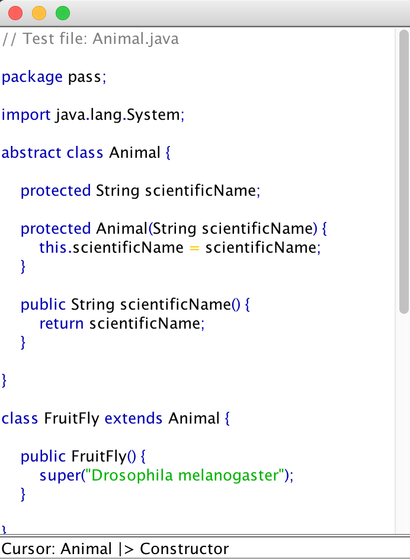

# J-- Compiler

A compiler for a subset of Java, written in Scala

### About J--

J-- is introduced in the book [*Introduction to Compiler Construction in a Java World*](http://www.cs.umb.edu/j--/index.html)

It supports about a half of Java's grammar, including non-nested classes and single inheritance.

Its grammar is specified in the files [lexicalgrammar](lexicalgrammar) and [grammar](grammar).
 
### Tokenization and Parsing

In this project, tokenization and parsing is implemented using Scala's combinator parsing library ([its 
github page](https://github.com/scala/scala-parser-combinators)), 
their implementations mostly sit in [Tokenizer.scala](src/main/scala/jmms/Tokenizer.scala) and [SyntaxParser.scala](src/main/scala/jmms/SyntaxParser.scala).

### Code Generation

This J-- compiler compiles .java files into JVM .class files. The code generation part is implemented with the aid of a wonderful
scala library called cafebabe([its github page](https://github.com/psuter/cafebabe)). I copied the source code of cafebabe 
into this project and has made some tiny modifications on it, to help me debug. But if you replace the cafebabe package with 
a direct use of its original jar files, this project should still compile and work as well.

### A Swing code editor (work in progress)

Run the main method from [CodePane.scala](src/main/scala/jmms/gui/CodePane.scala) and you will see a code editor pop up.
It's written using Java Swing's StyledDocument and JTextPane.

Currently it has some support for syntax highlighting and error reporting, and it can display the syntax tree structure corresponding 
to current cursor location. More functionality may be added in the future. 

